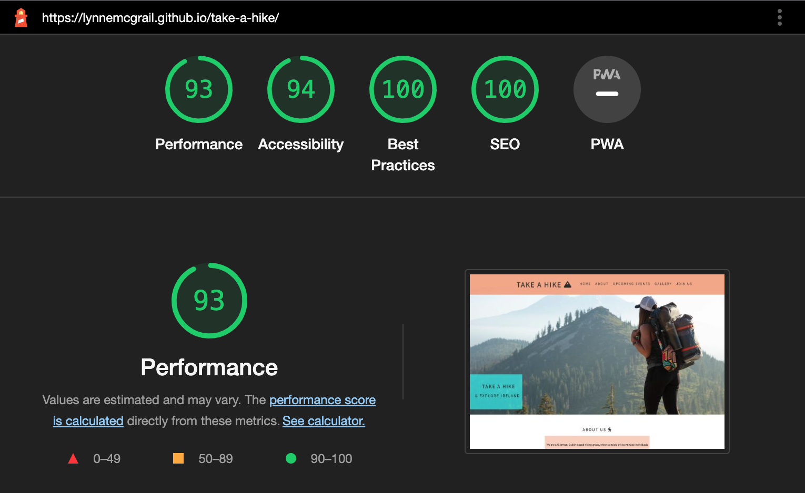

# PORTFOLIO PROJECT - 1 #

# Take a Hike #

## Goals for this project 
Take a Hike is a website designed to introduce local people to the hiking club which provides an outlet for any age groups, any gender and caters for all levels of experience. The hiking group was set up during the pandemic to encourage people to move more, meet new people, explore more, and maybe for some, to take up a new activity. The website provides information about the club, information about the benefits of hiking, the club's upcoming events, they are organised by difficulty level to show a potential member the options available when joining the group. The site also allows the person to make contact with the club easily through social media links or directly via the contact form on the site.

* [Here is a link to the final project](https://lynnemcgrail.github.io/take-a-hike/) 

## Final Design 

## Initial Idea Concept
My initial idea for the project was to create an informative and welcoming website about the activity of hiking in Ireland. My target audience is anyone who is interested in the activity itself or seeking to benefit their health and well-being, whilst meeting new people and establishing social connections.
This site can be any age group, any gender and any experience level. The site is safe for all age ranges from children to adults who want to learn about hiking in Ireland. I chose to make the site bright to display the information clearly and so people could navigate it easily.

* The Features I wanted the project to have are:
    * To make the site easy to read.
    * To have a light colour scheme (white background, dark text colour and complimenting bright colours throughout to represent nature which also tie in with the colours in the hero image).
    * To have an easy to navigate "Nav Bar".
    * Look fun and inviting with images, and to be educational on the health benefits associated with hiking.
    * To feature a map embedded to highlight where the Hiking Club's locality is based.
    * To be easy to make contact with the club through social media or the contact form on the site.

#
## Table of Contents
- [UX/UI](#uxui)
    * [USERSTORIES](#user-stories)
- [WIREFRAMES](#wireframes)
  * [FEATURES](#features)
  * [DESIGN](#design)
- [TESTING](#testing)
  * [DEVICES](#devices)
  * [VALIDATORS](#validators)
  * [LIGHTHOUSE](#lighthouse)
  * [ACCESSIBILITY](#accessibility)
- [SOLVED BUGS AND ERRORS](#solved-bugs-and-errors)
  * [UNSOLVED BUGS AND ERRORS](#unsolved-bugs-and-errors)
  * [FUNCTIONALITY](#functionality)
- [TECHNOLOGIES USED](#technologies-used)
  * [PROGRAMS USED](#programs-used)
- [DEPLOYMENT](#deployment)
  * [REMOTE](#remote-deployment)
  * [HOW TO FORK A REPOSITORY](#how-to-fork-a-repository)
  * [HOW TO CLONE A REPOSITORY](#how-to-clone-a-repository)
  * [HOW TO MAKE A LOCAL CLONE](#how-to-make-a-local-clone)

- [CREDITS](#credits-and-references)
  * [IMAGES AND INFORMATION](#images-and-information)
  * [CODE](#code)
- [ACKNOWLEDGEMENTS](#acknowledgements)

#
# UX/UI
* This website was created to demonstrate my knowledge of HTML and CSS and to provide users with visual and educational content.
* The website should be easy to navigate.
* The website should be easy to read, and images should be clear without becoming stretched or squashed.

## Site Goals
#
* To showccase my skills in HTML and CSS.
* To provide users with an easy to understand and easy to navigate website.
* To provide users with enough information to decide if they'd like to join the club.
* To make the site easily accessible for all users.

## User Stories 
#
* As a user, I want to understand the main purpose of the website.
* As a user, know that the club is well established.
* As a user, I want the website to give me the health benefits of hiking.
* As a user, I want to be able to navigate the site with an easy to see and read nav bar.
* As a user, I want the site to be attractive.
* As a user, I want to know what events are taking place.
* As a user, I want to see images related to the hiking group.
* As a user, I want to be able to easily contact the club.

## Requirements ##
#
- Easy to navigate on various screen sizes.
- Clear information on the services provided.
- Keep the user interested with small bits of information to make them want to engage with the club.
- Simple methods of contacting the club.
- Visually inviting and readable, so users do not leave.

## Expectations ##
#
- I expect to know if a form has been submitted properly and if items are not filled in, to be prompted -e.g. error message if email address required and not input properly.
- I expect all links to social media sites to be opened in a new tab.
- I expect all navigation links to work correctly and open in the same tab, but navigate to the section selected in the nav bar.
- I expect screen size not to affect the quality of the website.
- I expect all information to be correct and accurate.

## Wireframes 
#
* I used [Balsamic](https://balsamiq.com/) to develop my wireframes for my website. I initially created the mobile version, and then scalled it up for both tablet and desktop. Because one of my requirement is to give quality information to the user to make them want to engage with the club, a one-page website is used. This guides the user through the content and quickly to the contact form and details via scrolling or directly via the navigation bar.

The wireframes can be viewed [here]
(insert desktop wireframe here)
(insert tablet wireframe here)
(insert mobile wireframe here)

## Features 
#
* The site consists of:
    * 5 main sections on one page, `HOME, ABOUT, UPCOMING EVENTS, GALLERY, CONTACT US`
    * The page contains a `HEADER (TITLE)`, `NAVBAR`, `MAIN CONTENT (TEXT AND IMAGES)` and `FOOTER (SOCIAL MEDIA ICONS/LINKS`
* Navigation bar:
    * The navigation bar is fully responsive to allow for various screen sizes. It includes links to maneuver through the site easily with each menu option navigating to it's particular section. 
    
    * On mobile and tablet screen sizes you can see the hamburger menu option appears, highlighting the responsiveness of the site across device sizes 
     
    

* Footer:
* 

* Layout and content:
    * The Header section will have some introductory text and a landing image.
    * The About section follows with an introduction to the club and a 'Why Join Us' section which provides valuable information to the user about the benefits of hiking. 
    * The Gallery will have multiple images of the club's members, to encourage the site user to join.
    * The Contact Us section will have a form to include first name, last name, email address and a submit button
    * The thank-you page will have some thank-you text and a link back to the Home page.

* Hover effect on links and social media icons:
    * The blue shade indicates to the user the location of the mouse and selection that will be made, whilst navigating the menu
    

* Contact Form:
    * Form validation requests the user to input the correct information in the input fields, this avoids the user sending illegible text/email.
    * Input the use of radio buttons to demonstrate the skills I have learned to date through the course so far.
    * I added a thank you page for submitting the form so that the user is reassured that their message has been sent.
    * 

## DESIGN
#
* Color Scheme:
    * With being a website that is both informative and fun, the color scheme chosen were colourful and bright to reflect nature and being outdoors. Bright background colours were used and then colourful elements to make sections 'pop' on the site to provide an appealing user experience. The colours chosen for the text and images will be clear against the background so that the site is readable. (See hex colours below)
    * Need to test the contrast of the colours in WebAIM, (state pass or fail here). (Include any adjustments made).
    * #C9F4F4 - This colour will be used as a background colour for the navigation menu when items are hovered over.
    * Colour choices explained:
    * #13FFFF - This colour will be used as a background colour for text sections overlaying images with an appropriate text colour for readability.
    * #F39D75 - This colour will be used on the contact form for added styling.
    * #E36D50 - This colour will be used for styling the icons in the footer section 
    * #282828 - This colour will be used as a text colour and in any styling background where required. I chose a dark charcoal grey so it was readable but not as dark as black for the reader. 
    

## Landing Page 
* The landing page image chosen gives the user instant association that the club is about hiking, and with added zoom animation, immediately grabs their attention to the site.
* The image and text gives the user instant recognition as to what the club and site is about. 

## About Section 
* This section welcomes the site user and gives an insight into what the club ethos is, so the potential member gets a feel for the group they would be joining. 

## Images
* I sourced images for the hero image, upcoming events and members gallery from the following sources, Pexels and Unsplash.
* There are a total of 14 images across the site.
* All images have been compressed through `Tinypng.com`
* None of the images used have been pushed past the pixel limit in order to prevent image distortion

## Typography
* In order to move away from basic fonts available, I have used [Google Fonts](https://fonts.google.com/) on my site to find a font that best suits the feel of my website. The fonts I chose are [Assistant](https://fonts.google.com/specimen/Assistant?query=assistant) and a backup of [Sans Serif](https://fonts.google.com/knowledge/glossary/sans_serif), which were imported into my code, from [Google Fonts](https://fonts.google.com/).
#
# Design Choices 
## Icons 
I chose the icons for my website from the [Font Awesome library](https://fontawesome.com/icons). These icons will only be used where there is no explanation needed to their meaning, social media links, contact links and a hamburger for navigational links on smaller devices. All icons used will be styled in keeping with the appearance of the website.

## Structure 
* When building my website, I wanted it the styling to be responsive from desktop screen size to mobile screen size. The responsive media queries guidance used was [W3Schools](https://www.w3schools.com/css/css_rwd_mediaqueries.asp)

## Technologies used
* HTML
* CSS

## Programmes Used
* GIT
  * For version control, committing and pushing to github. 
* GITPOD 
  * The IDE used to code this website.
* GITHUB
  * Used to create and store repositories, files and images pushed from gitpod.
* Am I Responsive
  * Used to test the responsiveness of the website at different screen sizes 
* CHROME Developer Tools 
  * For checking compatibility, troubleshooting and editing code live to see what changes needed to be made. 
* Font Awesome 
  * Used for the logo, section titles and social media link icons in the footer of each page. The font awesome script is also linked in the HTML file for these to be visible on the site. 
  #
  
## Validation and accessibility
#
### **Lighthouse report**

  
Reports

  
  All pages of the app were tested using the lighthouse function built in to the Google Chrome browser on incognito mode.
  
  
  
  
  
  
  

  
### **WAVE Webaim Accessibility testing**

  
Reports

  ### **Accessibility report**
  The WAVE tool was used to test all pages on the app.
  Some errors repeat over each page tested, these were due to the social links not having text as they are fontawesome links.
  As before a summary of results is shown as well as links to the individual results.  
    
    
  [link to home page WAVE result](https://wave.webaim.org/report#/https://metal-re-injection.herokuapp.com/)  
  [link to login page WAVE result](https://wave.webaim.org/report#/https://metal-re-injection.herokuapp.com/accounts/login/)  
  [link to signup page WAVE result](https://wave.webaim.org/report#/https://metal-re-injection.herokuapp.com/accounts/signup/)  
  [link to tracklist page WAVE result](https://wave.webaim.org/report#/https://metal-re-injection.herokuapp.com/tracks/song-list/)  
  [link to rate a track page WAVE result](https://wave.webaim.org/report#/https://metal-re-injection.herokuapp.com/tracks/single-song/48/)

  There were 2 parts of the site that were inaccesible and due to this I was unable to check them with the tool. 
  * These were:
    - Mytracks page, Internal server error
    - Rate a track page, User must be signed in, WAVE wouldn't allow me to sign in
    

  ### **CSS Validation**
  

  
CSS Validator results

  Only the custom CSS file was tested (style.css)
  
  
  

  
 ### **HTML Validation**  
  

  
HTML Validator results

  All HTML was passed through the validator retreived from the source code within devtools on Chrome.

  [link to w3c validator result](https://validator.w3.org/nu/?showsource=yes&showoutline=yes&showimagereport=yes&doc=https%3A%2F%2Fmetal-re-injection.herokuapp.com%2F)
  
  

  # DEPLOYMENT
  ## Remote Deployment
  (Assuming you have already cloned or forked)
* Following writing the code, then committing and pushing to GitHub, this project was deployed using GitHub through the following the steps:

1. Navigate to the repository on GitHub and click on the `Settings` icon at the top of page in the navigation bar
2. Scroll down until you see `Github Pages` on the side navigation
3. Choose the branch in the drop down box, in this case `Main`
4. Choose the directory in the next drop down box, in this case `Root`
5. Then click `Save`
6. It may take a few moments for the site to publish, but once live, the box at the top of the page with the site name will turn green and have a `Green` tick to the left of the link to the live site
7. Another way to find the live site is to navigate to settings, on the left menu click on `pages` and this will get you to the same point.
8. Now the website is now live on https://lynnemcgrail.github.io/take-a-hike/
9. If any changes are required, they can be done, commited and pushed to GitHub and the changes will be updated.

## Git Commands Used
The following commands were used for version control during project:

* git add `example filename` - to add files before committing.
* git commit -m `"example message"` - to commit changes to the local repository.
* git push - to push all committed changes to the GitHub repository.
* git status to display the working area to see which changes have been staged and which haven't. 

## HOW TO FORK A REPOSITORY:

If you need to "FORK" a repository:

1. If you have not already, login in to [GitHub](www.github.com) and go to https://github.com/LynneMcGrail/take-a-hike
2. In the top right corner, click `Fork`
3. The next page will be the forked version of https://github.com/LynneMcGrail/take-a-hike but in your own repository

## HOW TO CLONE A REPOSITORY:

If you need to make a clone of this repository:

1. Fork the repository https://github.com/LynneMcGrail/take-a-hike using the steps above
2. Above the file list, click `Code` (Usually green at the top right of the code window)
3. Choose if you want to clone using HTTPS, SSH or GitHub CLI, then click the copy button to the right
4. Open Git Bash
5. Change the directory to where you want your clone to go (your own github)
6. Type `git clone` and then paste the URL you copied in step 4
7. Press `Enter` to create your clone

## HOW TO MAKE A LOCAL CLONE

If you need to make a local clone:

1. If you have not already, login in to [GitHub](www.github.com) and go to https://github.com/LynneMcGrail/take-a-hike
2. Under the repository name, above the list of files, click `Code`
3. Here you will have two options, `Clone` or `Download` the repository
4. You should close the repository using HTTPS, clicking on the icon to copy the link
5. At this point, you can launch the `Gitpod workspace` or choose your own directory
5. Open Git Bash
6. Change the current working directory to the new location of where you want the cloned directory to be
7. Type git clone and then paste the URL you copied in step 4
8. Press Enter, to create your local clone to your chosen directory
#
## Credits and References

### Images and Information Sources

* [The Hike Life](https://thehike.life/) for inspiration and information. 
* [Hike It Baby](https://hikeitbaby.com/) for ideas to inspire my project development.
* [Wikipedia](https://en.wikipedia.org/wiki/Hiking/) for information.
* Background image and Gallery images were from multiple sources. [Pexels](https://www.pexels.com/search/hiking/) and [Unsplash](https://unsplash.com/s/photos/hiking)

### Code Sources

* Kevin Powell on [Youtube](https://www.youtube.com/kepowob) for CSS tutorials on GRID and FLEXBOX
* Responsive Design tutorials on [Youtube](https://www.youtube.com/) for responsive code in CSS - Kevin Powell, and Web Dev Simplified were particularly helpful to me. 
* Help creating responsive navigation with no JS was [found here](https://www.youtube.com/watch?v=8QKOaTYvYUA&ab_channel=KevinPowell)
* The community on slack for feedback, and pointing me to [W3Schools](https://www.w3schools.com/) for more indepth guides to the uses of HTML and CSS. 
* Responsive media queries guidance was [W3Schools](https://www.w3schools.com/css/css_rwd_mediaqueries.asp)
* The guidance for the `hamburger menu` using CSS code was [unused-css.com](https://unused-css.com/blog/css-only-hamburger-menu/)

# 

## ACKNOWLEDGEMENTS:

- Code institute for the Mentors Tutors on the course. Especially our Facilitator and Masterclass mentor [Simen Daehlin](https://github.com/Eventyret)
- My Mentor [Jubril Akolade](@jubril_mentor) for guiding me in the right direction and helping me establish good coding practice. Also for his guidance and advice on developing a more responsive website.
- My fellow classmates for their ideas and enthusiasm on our facilitator sessions and masterclasses, and also their support on Slack.
- Everybody on Slack for tips, advice, quick fixes and kind words. Especially Chris Williams who gave me great advice and pointed me in the right direction for better coding practice.
- My family for their support and patience.

#### RETURN TO THE [TOP](#take-a-hike)